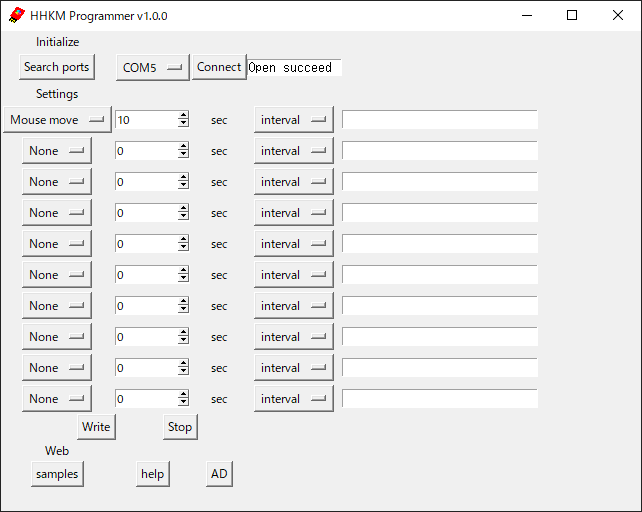
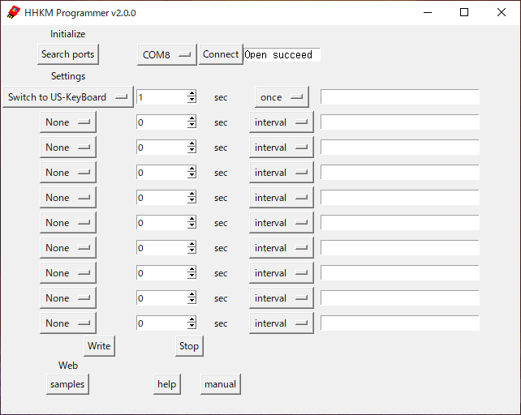

 # HHKM Programmer 操作マニュアル
このページは、HHKM Programmerの操作マニュアルおよびサンプル集です。

 ## 動作プログラム書き込みアプリ HHKM Programmer 入手・起動方法
 ### HHKM Programmer ダウンロード
 [リリースページ](https://github.com/ShowTakano/HHKM_Programmer/releases)からダウンロードしてください。

 ### 「WindowsによってPCが保護されました」と表示され、アプリを実行できない場合。
HHKM_Programmer.zipを解凍し、HHKM_Programmer.exeを右クリック、プロパティー、セキュリティーの項目の許可するにチェックし、適用、OKを選択してください。  

 ## 動作プログラム書き込みアプリ HHKM Programmer 操作手順

1. HHKMをUSBポートに接続  
2. HHKM Programmerを実行  
3. 「Search ports」を押し、接続したHHKMのポートを選択  
4. 「Connect」を押し、Open succeedを確認  
5. 登録したい動作を選択  
6. 時間を設定  
7. 「Write」を押し、HHKM本体に書き込み  
8. 【オプション】「Stop」開始した動作を止める。登録した動作をクリアする。  
9. 【オプション】「Samples」サンプル動作プログラム例を見る  

 ## 動作プログラム 例
 ### 10秒ごとにマウスを1ピクセル往復
 * スクリーンセーバーやログアウトを防ぐ。
 * ログインパスワードを入力する面倒を防ぐ。
 * ログアウトされて保存していなかったファイルが失われることを防ぐ。
 * 長時間のダウンロードが、止まってしまうことを防ぐ。
 * リモートデスクトップ接続が切れることを防ぐ。

 ### 1時間後にマウスクリック
 * メール送信ボタンを押す。
 * 応募ボタンを押す。
 
 
 ### 15秒ごとにF5を押し、ウェブサイトを再読み込み
 
 ### 2時間後にログアウト
 
 ### 8時間後に(上を数回押し)ログインパスワードを入力してエンターでログイン
 
 ### 30分後に画面のスクリーンショットを保存
 
 ### メモを記入して名前を付けて保存
 
 ### 4時間後にコマンドプロンプトを起動してPCの電源を切る
 
 ### JP/USキーボードを切り替える
   
 Typeコマンドを使用し、英数字記号などキーボード入力動作を登録する際には、お使いのキーボードのJP/US設定と合わせてご使用ください。  
 デフォルトではJPキーボード設定となっております。  
 JPモードでの接続時の色: 青  
 USキーボードに切り替えたい場合、"Switch to US-KeyBoard" を選択し、書き込んでください。  
 "次回の接続時からJPキーボードに切り替えます。HHKMをUSBポートから抜いてください。アプリも再起動してください。" のポップアップの指示に従い、ADHHKM本体をPCから抜いてください。次回接続時から切り替えます。  
 USモードでの接続時の色:黄  

 ## コマンド一覧
 |command|動作|
|--|--|
|Mouse left-click|マウス左クリック|
|Mouse right-click|マウス右クリック|
|Mouse move|マウスカーソルを1ピクセル往復|
|Key up|上矢印「↑」押下|
|Key down|下矢印「↓」押下|
|Key left|左矢印「←」押下|
|Key right|右矢印「→」押下|
|Key Tab|Tabキー押下|
|Key Esc|Escキー押下|
|Key F2|F2キー押下|
|Key F5|F5キー押下|
|Key PrintScreen|PrintScreenキー押下|
|Key Windows|Windowsキー押下|
|Key command (OSX)|commandキー押下(OSX)|
|Key command (Linux)|commandキー押下(Linux)|
|Key Enter|Enterキー押下|
|Key Shift (keep)|Shiftキー保持|
|Key Ctrl (keep)|Ctrlキー保持|
|Key Alt (keep)|Altキー保持|
|Key Del (keep)|Delキー保持|
|Key command (OSX) (keep)|commandキー保持|
|Key release-all|保持しているキーをすべて離す|
|Type|登録された半角英数字を入力(,;:は使用不可)(1行につき64文字以内)|
|Command-prompt(Win)|windowsのコマンドプロンプトを開く|
|Terminal(OSX)|terminalを開く(OSX)  # (command-N)|
|Terminal(Linux)|terminalを開く(OSX)  # (ctrl-alt-t)|
|Log-out(Win)|ログアウト(windows)  # (ctrl-alt-del down down enter)|
|Log-out(OSX)|ログアウト(OSX)  # (command-Shift-Q enter)|
|Log-out(Linux)|ログアウト(Linux)  # (ctrl-alt-del enter)|
|Switch to US-KeyBoard|次回接続時にUSキーボードに切り替え|
|Switch to JP-KeyBoard|次回接続時にJPキーボードに切り替え|

 ### once / interval
 各コマンド毎に、一度だけの実行(once)か、一定間隔での繰り返し実行(interval)か選択可能です。
 ### Type
 半角英数字記号を記入させることが可能です。  
 ,;:は使用不可。1行につき最大64文字です。  
 JP/USキーボード切り替え機能を使用し、お客様の環境に合わせてご使用ください。デフォルトではJPキーボードです。  