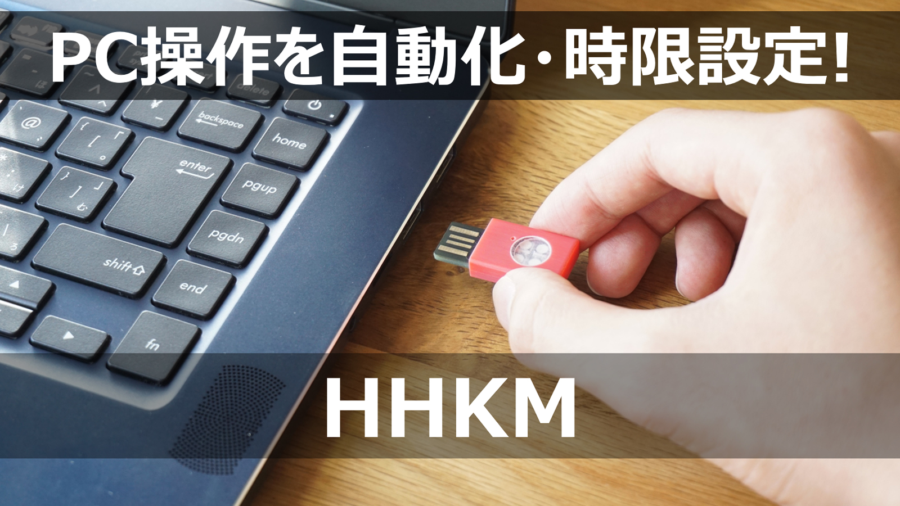
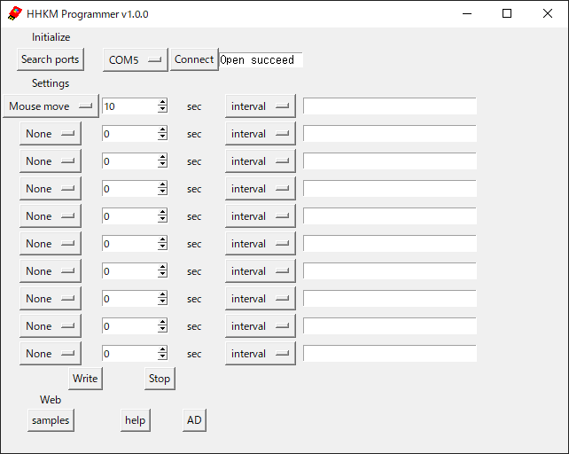

 # HHKM Programmer サポートページ
このページは、ADHHKMのサポートページです。

 ## ADHHKM とはなんですか？
 # マウス・キーボードの動作を自動化・時限設定できるUSBデバイスと、その専用アプリです!
 - スクリーンセーバー・ログアウトを防止、1時間後にメールを送信、など自由自在！
 - ドライバーフリー！アプリインストール無し！PCからはキーボード・マウスとして認識されます。
 - JP/USキーボード切替に対応
 - Windows/Mac対応 (Win版とMac版の各専用アプリがあります)

 # 使用例(1)
 ## 10秒ごとにマウスをほんの少しだけ往復。スクリーンセーバーやログアウトを防止

通常のマウスを使用するのと同時に、HHKMを使用することができます。  
通常のマウス操作中に、HHKMによってマウスがすこし動かされたとしても、作業の邪魔にはなりません。

USBハブを使用することも可能です。

 ### リモート授業やテレワークで、"やってるフリ"ができるかも？！
 (やりすぎ注意。)

 # 使用例(2)
 ## キーボード操作を登録して、自動で文字を入力

 ### もちろん他のPCでも同じように動作します！

 ### などなど、組み合わせは無限大!!

 ## クラウドファンディングで目標金額の2921%を達成した大好評プロダクトの完成版です！

[クラウドファンディングページこちら](https://www.makuake.com/project/narrativelab_hhkm/)

 # ユーザーマニュアルおよび動作サンプル集は[こちら](Manual.md)から！